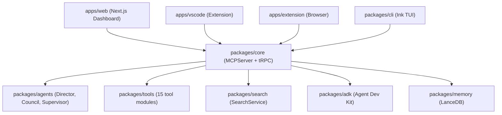

# 🔬 Hypercode Codebase Audit — Full Status Report

**Date**: 2026-02-07 | **Auditor**: Opus 4.6 | **For**: Gemini 3 Pro High  
**Scope**: All packages, apps, services, tools, UI pages, CLI, and routers

---

## Architecture Overview

---

## 1. Packages Inventory (25 total)

| Package | Status | Notes |
|---------|--------|-------|
| `core` | ✅ Active | MCPServer, tRPC, all services |
| `agents` | ✅ Active | Director, Council, Supervisor |
| `tools` | ✅ Active | 15 tool modules exported |
| `adk` | ✅ Active | IMCPServer interfaces |
| `search` | ✅ Active | SearchService (ripgrep-based) |
| `ai` | ⚠️ Unclear | LLMService / ModelSelector |
| `memory` | ⚠️ Unclear | LanceDB-based vector store |
| `cli` | ✅ Active | Ink TUI (App.tsx + components) |
| `tui` | ❌ Empty | `src/` doesn't exist |
| `ui` | ⚠️ Shared | Design system + widgets |
| `types` | ✅ Active | Shared TypeScript types |
| `browser` | ⚠️ Unclear | Puppeteer wrapper? |
| `browser-extension` | ⚠️ Unclear | Separate from `apps/extension` |
| `hypercode-supervisor` | ⚠️ Unclear | Autonomous agent logic |
| `supervisor-plugin` | ⚠️ Unclear | Plugin for supervisor |
| `mcp-client` | ⚠️ Stub | Only 3 files |
| `mcp-router-cli` | ⚠️ Stub | Only 1 file |
| `jetbrains` | ⚠️ Stub | 5 files, likely incomplete |
| `nvim-plugin` | ⚠️ Stub | 4 files |
| `zed-extension` | ⚠️ Unclear | 300 files, needs investigation |
| `sdk-go` | ❌ Stub | 1 file |
| `sdk-python` | ❌ Stub | 2 files |
| `sdk-rust` | ❌ Stub | 1 file |
| `tsconfig` | ✅ Config | Shared tsconfig |
| `vscode` | ⚠️ Junction | Points to `apps/vscode` |

---

## 2. Core Services (35 files in `packages/core/src/services/`)

### ✅ Fully Wired (Service → TRPC Router → Dashboard Page)

| Service | TRPC Router | Dashboard Page |
|---------|-------------|----------------|
| `HealerService` | `healer` (inline) | `/dashboard/healer` |
| `DarwinService` | `darwin` (inline) | `/dashboard/evolution` |
| `KnowledgeService` | `knowledgeRouter` | `/dashboard/knowledge` |
| `MemoryManager` | `memoryRouter` | `/dashboard/memory` |
| `DeepResearchService` | `researchRouter` | `/dashboard/research` |
| `CouncilService` | `councilRouter` (modular) | `/dashboard/council` |
| `EventBus` | `pulseRouter` | `/dashboard/pulse` & `/dashboard/events` |
| `SkillAssimilationService` | `skillsRouter` | `/dashboard/skills` |
| `SubmoduleService` | `submodule` (inline) | `/dashboard/submodules` |
| `PolicyService` | `policy` (inline) | `/dashboard/security` |
| `AuditService` | `audit` (inline) | `/dashboard/chronicle` |
| `AutoDevService` | `autoDevRouter` | `/dashboard/command` |
| `AutoTestService` | `autoTest` (inline) | (via tests page) |
| `CodeModeService` | `sandbox` (inline) | `/dashboard/workshop` |

### ⚠️ Partially Wired (Backend exists, UI/CLI gaps)

| Service | TRPC? | Dashboard? | Gap |
|---------|-------|-----------|-----|
| `AgentMemoryService` (17KB) | ❌ No router | ❌ No page | Large service with no direct API exposure |
| `BrowserService` | ❌ No router | ❌ No page | Tools exist in MCPServer but no dashboard |
| `GitService` | `git` (inline) | ❌ No dedicated page | Accessible via submodules page only |
| `LSPService` (20KB) | ❌ No router | ❌ No page | Tools registered in MCPServer only |
| `MetricsService` | `metrics` (inline) | ❌ No page | Backend exists, no visualization |
| `PlanService` (16KB) | ❌ No router | ❌ No page | Large service, underpowered exposure |
| `RepoGraphService` (9KB) | `graphRouter` | ❌ No page | Router exists but `/dashboard/architecture` is likely stub |
| `ShellService` | `shellRouter` | ❌ No page | Backend only |
| `SymbolPinService` | `symbolsRouter` | ❌ No page | Backend only |
| `ResearchService` | ❌ Unclear | `/dashboard/research` | May overlap with `DeepResearchService` |
| `ContextPruner` | `contextRouter` | ❌ No page | Backend only |

### ❌ Not Wired (Backend exists, completely disconnected)

| Service | Size | Issue |
|---------|------|-------|
| `Dummy.test.ts` | 296B | Test placeholder, harmless |

---

## 3. Orchestration Layer (`packages/core/src/orchestrator/`)

| File | Status | Wired? |
|------|--------|--------|
| `SquadService.ts` | ✅ Functional | TRPC: `squadRouter`, Dashboard: `/dashboard/squads`, MCPServer tools: `start_squad`, `list_squads`, `kill_squad` |
| `WorkflowEngine.ts` (22KB) | ✅ Functional | TRPC: `workflowRouter`, Dashboard: `/dashboard/workflows` |
| `SystemWorkflows.ts` | ✅ Functional | Registered workflows (Code Review, Deployment) |
| `GitWorktreeManager.ts` | ⚠️ Partial | Used by SquadService, but `git_worktree_*` tools were **just added** (Phase 51 fix) |
| `AgentAdapter.ts` | ✅ Active | Adapter pattern for multi-model agents |
| `AgentCommunication.ts` | ⚠️ Stub | 539B — very minimal |
| `MergeService.ts` | ⚠️ Stub | 1.8KB — basic merge logic |
| `MetaOrchestrator.ts` | ⚠️ Stub | 1.3KB — placeholder for meta-orchestration |
| `adapters/ClaudeAdapter.ts` | ✅ Active | Claude model adapter |
| `adapters/GeminiAdapter.ts` | ✅ Active | Gemini model adapter |

---

## 4. Agents (`packages/agents/src/`)

| Agent | Size | Status |
|-------|------|--------|
| `Director.ts` | 41KB | ✅ **Core agent**. Auto-drive, task execution, memory integration. Fully wired to TRPC (`director`) and MCPServer. |
| `Council.ts` | 12KB | ✅ **Consensus engine**. Multi-persona debate + voting. Wired to TRPC (`council`) and Dashboard. |
| `Supervisor.ts` | 5.5KB | ⚠️ **Partially wired**. Delegation logic exists but no dedicated TRPC router or dashboard page. Used internally by Director. |
| `orchestration/` | 1 file | ⚠️ Unknown — needs investigation |

---

## 5. Reactive System (Sensors + Reactors)

| Component | Status | Wired? |
|-----------|--------|--------|
| `FileSensor` | ✅ Active | Emits `file:changed` events to EventBus |
| `TerminalSensor` | ✅ Active | Emits `terminal:error` events |
| `AutoTestReactor` | ✅ Active | Triggers tests on file changes |
| `HealerReactor` | ✅ Active | Auto-heals on terminal errors |

> **All sensors and reactors are wired** to the EventBus. Dashboard visibility at `/dashboard/events`.

---

## 6. Security Layer (`packages/core/src/security/`)

| File | Status |
|------|--------|
| `PermissionManager.ts` | ✅ Active — Autonomy levels (low/medium/high) |
| `PolicyService.ts` | ✅ Active — RBAC rules, lockdown/unlock |
| `PolicyEngine.ts` | ✅ Active — Rule evaluation engine |
| `AuditService.ts` | ✅ Active — Event logging |
| `SandboxService.ts` | ✅ Active — Process isolation for code execution |

---

## 7. Dashboard Pages (25 routes) — Cross-Reference

| Page | Backend Source | Status |
|------|--------------|--------|
| `/dashboard/architecture` | `RepoGraphService` | ⚠️ **Likely stub** — page exists but graph visualization unclear |
| `/dashboard/billing` | `billing` (mock data) | ⚠️ **Mock only** — hardcoded usage data |
| `/dashboard/brain` | Director status | ✅ Active |
| `/dashboard/chronicle` | `AuditService` | ✅ Active |
| `/dashboard/command` | `AutoDevService` | ✅ Active |
| `/dashboard/config` | `directorConfig` | ✅ Active |
| `/dashboard/council` | `CouncilService` | ✅ Active |
| `/dashboard/director` | Director status/control | ✅ Active |
| `/dashboard/events` | `EventBus` | ✅ Active |
| `/dashboard/evolution` | `DarwinService` | ✅ Active |
| `/dashboard/healer` | `HealerService` | ✅ Active |
| `/dashboard/inspector` | `MCPAggregator` traffic | ✅ Active |
| `/dashboard/knowledge` | `KnowledgeService` | ✅ Active |
| `/dashboard/library` | Static docs reader | ✅ Active |
| `/dashboard/mcp` | `MCPAggregator` | ✅ Active |
| `/dashboard/memory` | `MemoryManager` | ✅ Active |
| `/dashboard/pulse` | `EventBus` polling | ✅ Active |
| `/dashboard/reader` | `ReaderTools` | ✅ Active |
| `/dashboard/research` | `DeepResearchService` | ✅ Active |
| `/dashboard/security` | `PolicyService` | ✅ Active |
| `/dashboard/skills` | `SkillAssimilationService` | ✅ Active |
| `/dashboard/squads` | `SquadService` | ✅ Active |
| `/dashboard/submodules` | `SubmoduleService` | ✅ Active |
| `/dashboard/workflows` | `WorkflowEngine` | ✅ Active |
| `/dashboard/workshop` | `CodeModeService` | ✅ Active |

---

## 8. CLI / TUI Status

| Component | Path | Status |
|-----------|------|--------|
| `packages/cli/src/index.ts` | CLI entry | ✅ Active — Ink-based TUI |
| `packages/cli/src/ui/App.tsx` | Main TUI layout | ✅ Active — Header, EventLog, AgentStatus, CommandInput |
| `packages/cli/src/ui/components/` | 4 components | ✅ Active |
| `packages/tui/` | Alternate TUI? | ❌ **Dead** — `src/` doesn't exist, 84 files (likely artifacts) |

---

## 9. Tools Inventory (`packages/tools/`)

15 tool modules exported from `@hypercode/tools`:

| Module | Tools Count | Status |
|--------|------------|--------|
| `BrowserTool` | 1+ | ✅ Active |
| `ChainExecutor` | 1 | ✅ Active |
| `ConfigTools` | 2+ | ✅ Active |
| `FileSystemTools` | 8+ | ✅ Active |
| `InputTools` | 2+ | ✅ Active |
| `LogTools` | 1+ | ✅ Active |
| `MemoryTools` | 3+ | ✅ Active |
| `MetaTools` | 1+ | ✅ Active |
| `ReaderTools` | 2+ | ✅ Active |
| `SearchTools` | 2+ | ✅ Active |
| `SystemStatusTool` | 1 | ✅ Active |
| `TerminalTools` | 3+ | ✅ Active |
| `TunnelTools` | 3+ | ✅ Active |
| `WorktreeTools` | 2+ | ✅ Active |
| `ProcessRegistry` | 1+ | ✅ Active |

### MCPServer-Only Tools (Not in `@hypercode/tools`)

These are registered in `MCPServer.setupHandlers` and `executeTool` but NOT exported as reusable modules:

- `start_squad`, `list_squads`, `kill_squad` — Swarm
- `git_worktree_add`, `git_worktree_remove`, `git_worktree_list` — Git Worktrees  
- `browser_navigate`, `browser_click`, `browser_input`, `browser_extract` — Browser automation
- `council_start`, `council_opine`, `council_vote` — Council
- `darwin_evolve`, `darwin_experiment` — Evolution
- `research_topic`, `research_recursively` — Research
- `memory_search`, `memory_index_codebase` — Memory
- `assimilate_skill` — Skill acquisition
- `vscode_get_status`, `vscode_execute_command` — VS Code bridge
- `browser_screenshot`, `memorize_page` — Browser memory
- `execute_code`, `enable_code_mode`, `disable_code_mode` — Code sandbox
- `mcp_add_server` — Dynamic MCP expansion
- `system_status`, `system_diagnostics` — System health
- Various workflow/plan tools

---

## 10. Critical Findings & Gaps

### 🔴 High Priority

1. **`packages/tui` is dead** — Has 84 files but no `src/` directory. Should be removed or consolidated with `packages/cli`.

2. **Stale `.js`/`.d.ts` files in source directories** — Found `.js` and `.d.ts` files alongside `.ts` sources in:
   - `packages/core/src/services/` (AgentMemoryService, CouncilService, ContextPruner, MemoryManager)
   - `packages/agents/src/` (Council, Director)
   - `packages/core/src/security/` (PermissionManager)
   
   > These can cause `tsx` to load stale JavaScript instead of compiling TypeScript, leading to mysterious bugs (as seen with Phase 51's "Tool not found" error).

3. **`AgentMemoryService` (17KB) has NO TRPC router** — This is a substantial service with tiered memory (STM/LTM/Episodic) that's used internally by Director but has no API exposure for the Dashboard.

4. **`PlanService` (16KB) has NO TRPC router** — Large Plan/Build mode service with diff staging, approval, and checkpoint logic. Only accessible via MCPServer tools.

5. **`LSPService` (20KB) has NO TRPC router** — Language Server Protocol integration. Only accessible via MCPServer tools.

6. **Billing page uses mock data** — Hardcoded `$42.50` usage. No real cost tracking.

### 🟡 Medium Priority

7. **`MetaOrchestrator.ts` is a stub** (1.3KB) — Placeholder for multi-agent orchestration. Not wired to anything.

8. **`AgentCommunication.ts` is a stub** (539B) — Inter-agent message passing. Not functional.

9. **`MergeService.ts` is minimal** (1.8KB) — Basic merge logic. Not wired to TRPC or UI.

10. **SDK packages are empty stubs** — `sdk-go`, `sdk-python`, `sdk-rust` each have 1-2 files. Not functional.

11. **`MetricsService` has no dashboard page** — TRPC route exists (`metrics.getStats`) but no visualization page.

12. **`ResearchService` vs `DeepResearchService`** — Two overlapping services. `ResearchService` (5KB) may be legacy.

13. **`RepoGraphService` (9KB) has ambiguous UI** — `graphRouter` exists and is registered twice (as `graph` and `repoGraph`), but `/dashboard/architecture` page status is unclear.

### 🟢 Low Priority / Cosmetic

14. **Duplicate `result` assignment** in `kill_squad` handler was fixed but similar patterns may exist elsewhere.

15. **Heavy `@ts-ignore` usage** in `trpc.ts` — 40+ instances of `// @ts-ignore` for `global.mcpServerInstance` access. Could benefit from a typed accessor helper.

16. **Test log files scattered in root** — 19 `test_output_*.log` files in project root should be gitignored or moved.

17. **`Router.ts` (legacy)** — The original MCP Router is still present alongside `MCPAggregator`. The `executeTool` fallback chain goes: Internal handlers → Standard Library → Aggregator → Router. Router could potentially be removed.

---

## 11. Phase Status Summary (from task.md)

| Phase | Name | Status |
|-------|------|--------|
| 15-22 | Foundation (VS Code, MCP, Context, Search) | ✅ Complete |
| 23-25 | Deep Search, Orchestration, Aggregator | ✅ Complete |
| 27-31 | Knowledge Graph, Observability, Research | ✅ Complete |
| 32-36 | Security, Self-Correction, Evolution, Polish | ✅ Complete |
| 37-42 | Council, Research, Memory, Skill Acquisition | ✅ Complete |
| 43-44 | Nervous System, Immune System | ✅ Complete |
| 45-47 | Knowledge Ingestion, Tool Orchestration, Autonomy | ✅ Complete |
| 48 | Navigator (Autonomous Browsing) | ✅ Complete |
| 49 | Interface (CLI TUI) | ✅ Complete |
| 50 | Architect (System Prompt Hardening) | ✅ Complete |
| 51 | The Swarm (Squads & Delegation) | ✅ Complete |
| 38.4 | Knowledge Graph visualization improvements | ❌ Open |
| 39 | Director Upgrade + Squad Autonomy + Director Dashboard | ❌ Open (3 items) |

---

## 12. Recommendations for Next Agent

1. **Clean stale artifacts** — Delete all `.js` and `.d.ts` files from `src/` directories. They cause `tsx` module resolution bugs.

2. **Create TRPC routers** for `AgentMemoryService`, `PlanService`, and `LSPService` — these are substantial services that deserve API/UI exposure.

3. **Delete `packages/tui`** — Dead package with no source code.

4. **Add `MetricsService` dashboard page** — Backend exists, just needs visualization.

5. **Resolve `ResearchService` vs `DeepResearchService` overlap** — Consolidate or clarify roles.

6. **Replace billing mocks** with real cost tracking (even estimations based on token counts).

7. **Wire `Supervisor` agent** to TRPC + Dashboard — It's a functional agent used internally but invisible to users.

8. **Remove or consolidate legacy `Router.ts`** — `MCPAggregator` supersedes it.

9. **Implement Phase 39 items** — Director upgrade, Squad autonomy, Director dashboard are the last open items.

10. **Add typed accessor for `global.mcpServerInstance`** — Eliminate 40+ `@ts-ignore` comments in `trpc.ts`.
