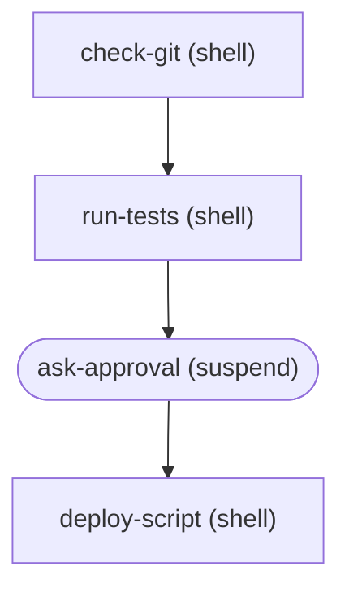

# opencode-workflows **Deprecated** - use [keystone](https://github.com/mhingston/keystone-cli) instead

Workflow automation plugin for OpenCode using the Mastra workflow engine. Define deterministic, multi-step processes that agents can trigger to perform complex tasks reliably.

## Features

- **Deterministic Automation**: Define rigid, multi-step processes (DAGs) in JSON, YAML, or TypeScript
- **YAML Support**: Multi-line prompts and shell scripts are clean and readable
- **Agentic Triggering**: Agents can call workflows as tools
- **Hybrid Execution**: Mix shell commands, API calls, and LLM prompts
- **Human-in-the-Loop**: Suspend workflows for human approval
- **Parallel Execution**: Run independent steps concurrently
- **Live Progress & Resilience**: Progress streams to the initiating chat session, and active workflows auto-suspend on chat interruption so you can resume later

## Installation

Add to your OpenCode config:

```jsonc
// opencode.jsonc
{
  "plugin": ["opencode-workflows@latest"]
}
```

Using `@latest` ensures you always get the newest version automatically when OpenCode starts.

Restart OpenCode. The plugin will automatically load.

### Configuration

The plugin uses sensible defaults but can be configured via environment variables:

| Environment Variable | Default | Description |
|---------------------|---------|-------------|
| `WORKFLOW_DIRS` | `.opencode/workflows,~/.opencode/workflows` | Comma-separated directories to scan for workflow JSON files |
| `WORKFLOW_DB_PATH` | `.opencode/data/workflows.db` | SQLite database path for persisting workflow runs |
| `WORKFLOW_TIMEOUT` | `300000` (5 min) | Global timeout for workflow execution in milliseconds |
| `WORKFLOW_VERBOSE` | `false` | Enable verbose debug logging |
| `WORKFLOW_MAX_COMPLETED_RUNS` | `1000` | Maximum number of completed runs to keep in memory |
| `WORKFLOW_MAX_RUN_AGE` | `30` | Maximum age of runs to keep in database (days). Older runs are automatically deleted. |
| `WORKFLOW_ENCRYPTION_KEY` | - | 32-character encryption key for encrypting secret inputs at rest |

### Performance Optimizations

The plugin includes several optimizations for fast startup, especially with large workflow histories:

**Lazy Compilation**: Workflows are compiled on-demand when first accessed, not at startup. This dramatically reduces initialization time when you have many workflow definitions.

**Background Loading**: Historical workflow runs are loaded in the background after initialization:
- Active runs (pending, running, suspended) load immediately
- Recent completed runs (most recent 100) load in the background
- Older runs can be loaded on-demand with pagination

**Automatic Cleanup**: Runs older than `maxRunAge` days are automatically deleted at midnight to prevent unbounded database growth. Only terminal-state runs (completed, failed, cancelled) are deleted; active workflows are preserved.

**Memory Management**: The `maxCompletedRuns` setting limits how many completed runs are kept in memory. Older runs are automatically removed but remain accessible via database queries.

**Database Optimization**: The plugin uses SQLite with WAL mode and composite indexes for optimal query performance.

These optimizations ensure OpenCode starts instantly even with thousands of historical workflow runs.

### Structured Logging

The plugin supports structured logging for observability and log aggregation systems. Logs include contextual information like `workflowId`, `runId`, and `stepId`.

**Programmatic Configuration:**

```typescript
import { createLogger } from "opencode-workflows/loader";

// JSON format for log aggregation (e.g., DataDog, Splunk, CloudWatch)
const logger = createLogger({ format: "json", verbose: true });

// Custom output handler
const logger = createLogger({
  output: (entry) => {
    // entry: { timestamp, level, message, workflowId?, runId?, stepId?, durationMs?, metadata? }
    myLogAggregator.send(entry);
  }
});
```

**JSON Log Format:**

```json
{"timestamp":"2024-01-15T10:30:00.000Z","level":"info","message":"Workflow deploy-prod completed successfully","workflowId":"deploy-prod","runId":"abc-123","durationMs":45000}
```

**Text Log Format (default):**

```
[workflow] [INFO] [workflow=deploy-prod run=abc-1234 step=build duration=5000ms] Step completed
```

### Persistence

Workflow runs are automatically persisted to a LibSQL (SQLite) database. This enables:

- **Crash Recovery**: Active runs are restored on plugin restart
- **Run History**: Query past workflow executions via the workflow tool (`mode=runs`, or `/workflow runs` if you've added a slash alias)
- **Suspend/Resume**: Suspended workflows survive session restarts
- **Session-aware progress**: Progress updates are routed to the originating session; if the chat is interrupted, workflows are suspended and can be resumed with the workflow tool (`mode=resume`, or `/workflow resume <runId>` if you configured a slash alias)

The database is created automatically at the configured `dbPath`.

### Secrets and Sensitive Input Handling

Workflows often need to handle sensitive data like API keys, passwords, and tokens. The plugin provides built-in security features to protect these values:

#### Marking Inputs as Secrets

Add a `secrets` array to your workflow definition listing which input names contain sensitive data:

```json
{
  "id": "deploy-with-credentials",
  "description": "Deploy using API credentials",
  "inputs": {
    "environment": "string",
    "apiKey": "string",
    "dbPassword": "string"
  },
  "secrets": ["apiKey", "dbPassword"],
  "steps": [
    {
      "id": "deploy",
      "type": "shell",
      "command": "deploy.sh --env={{inputs.environment}} --key={{inputs.apiKey}}"
    }
  ]
}
```

#### What Gets Protected

1. **Log Masking**: Any input listed in `secrets` is replaced with `***` in console output
   - The command `deploy.sh --env=prod --key=sk-12345` appears as `deploy.sh --env=prod --key=***`

2. **Environment Variables**: All `{{env.*}}` interpolations are automatically treated as secrets
   - No need to add them to the `secrets` array
   - `{{env.API_KEY}}` is always masked in logs

3. **Storage Encryption**: When an encryption key is configured, secret inputs are encrypted at rest in the SQLite database using AES-256-GCM

#### Configuring Storage Encryption

To enable encryption for secrets stored in the database, configure an encryption key:

```typescript
import { createWorkflowPlugin } from "opencode-workflows";

const plugin = createWorkflowPlugin({
  storage: {
    encryptionKey: process.env.WORKFLOW_ENCRYPTION_KEY
  }
});
```

The encryption key should be:
- Exactly 32 characters for AES-256
- Stored securely (environment variable, secrets manager)
- Never committed to version control

When encryption is enabled:
- Secret inputs are encrypted before being saved to the database
- Secrets are automatically decrypted when loading workflow runs
- Non-secret inputs remain unencrypted for easier debugging

#### Example: Secure API Deployment

```json
{
  "id": "secure-deploy",
  "description": "Deploy with encrypted credentials",
  "inputs": {
    "version": "string",
    "apiToken": "string",
    "webhookSecret": "string"
  },
  "secrets": ["apiToken", "webhookSecret"],
  "steps": [
    {
      "id": "deploy",
      "type": "shell",
      "command": "deploy --version={{inputs.version}} --token={{inputs.apiToken}}"
    },
    {
      "id": "notify",
      "type": "http",
      "method": "POST",
      "url": "https://api.example.com/webhooks",
      "headers": {
        "Authorization": "Bearer {{inputs.webhookSecret}}"
      },
      "body": {
        "version": "{{inputs.version}}",
        "status": "deployed"
      },
      "after": ["deploy"]
    }
  ]
}
```

In the logs, you'll see:
```
> deploy --version=1.0.0 --token=***
```

And in the database, the `apiToken` and `webhookSecret` values are stored encrypted.

## Workflow Definitions

Create workflow definitions in `.opencode/workflows/` as JSON, JSONC, YAML, or TypeScript files. JSONC files support comments, while YAML files offer the best experience for multi-line content like prompts and shell scripts.

### Why YAML?

YAML is the recommended format for workflows that contain **LLM prompts** or **multi-line shell scripts**. Key benefits:

1. **Multi-line Strings**: Use the `|` block scalar operator for clean, readable prompts
2. **Native Comments**: No special syntax needed - just use `#`
3. **Cleaner Syntax**: No commas or quotes required for simple values

**Comparison:**

*JSON (hard to read):*
```json
"prompt": "Review this code.\n\nLook for:\n1. Security bugs\n2. Performance issues"
```

*YAML (much cleaner):*
```yaml
prompt: |
  Review this code.

  Look for:
  1. Security bugs
  2. Performance issues
```

### YAML Workflow Example

```yaml
# .opencode/workflows/code-review.yaml
$schema: https://raw.githubusercontent.com/mark-hingston/opencode-workflows/main/schemas/workflow.schema.json
id: code-review
name: Multi-Agent Code Review
description: Parallel expert code review with synthesis

inputs:
  file: string

steps:
  - id: read_file
    type: file
    description: Read the source file
    action: read
    path: "{{inputs.file}}"

  - id: security_review
    type: agent
    description: Security vulnerability analysis
    agent: security-reviewer
    after: [read_file]
    # Multi-line prompts are clean and readable!
    prompt: |
      Review this code for security issues:

      {{steps.read_file.content}}

  - id: synthesize
    type: agent
    description: Combine reviews into a report
    agent: tech-lead
    after: [security_review]
    prompt: |
      Combine these reviews into a prioritized report:

      ## Security Review
      {{steps.security_review.response}}
```

### TypeScript Workflow Definitions

For type safety, code reuse, and dynamic configuration, you can define workflows in TypeScript:

```typescript
// .opencode/workflows/deploy.ts
import type { WorkflowDefinition } from "opencode-workflows";

const workflow: WorkflowDefinition = {
  id: "deploy-prod",
  description: "Deploy to production with type safety",
  inputs: {
    version: "string",
    environment: "string",
  },
  steps: [
    {
      id: "build",
      type: "shell",
      command: "npm run build",
    },
    {
      id: "deploy",
      type: "shell",
      command: "deploy --version={{inputs.version}} --env={{inputs.environment}}",
      after: ["build"],
    },
  ],
};

export default workflow;
```

**Dynamic Workflow Generation:**

Export a function for workflows that need runtime configuration:

```typescript
// .opencode/workflows/multi-deploy.ts
import type { WorkflowDefinition } from "opencode-workflows";

export default async function(): Promise<WorkflowDefinition> {
  // Could fetch configuration from an API or file
  const regions = ["us-east-1", "eu-west-1", "ap-south-1"];
  
  return {
    id: "multi-region-deploy",
    steps: regions.map((region, index) => ({
      id: `deploy-${region}`,
      type: "shell" as const,
      command: `deploy --region ${region}`,
      after: index > 0 ? [`deploy-${regions[index - 1]}`] : undefined,
    })),
  };
}
```

**Supported File Extensions:** `.ts`, `.js`, `.mts`, `.mjs`

TypeScript files are compiled at runtime using [jiti](https://github.com/unjs/jiti), so no build step is required.

### JSON Schema

Workflow files support JSON Schema for IDE validation and autocomplete. Add the `$schema` property to your workflow files:

```json
{
  "$schema": "https://raw.githubusercontent.com/mark-hingston/opencode-workflows/main/schemas/workflow.schema.json",
  "id": "my-workflow",
  ...
}
```

This provides:
- **Autocomplete** for step types, properties, and values
- **Inline validation** for required fields and type mismatches
- **Hover documentation** for properties

### Example Workflow

```jsonc
{
  "$schema": "https://raw.githubusercontent.com/mark-hingston/opencode-workflows/main/schemas/workflow.schema.json",
  // Unique workflow identifier
  "id": "deploy-prod",
  "description": "Deploys the application to production",
  "inputs": {
    "version": "string"
  },
  "steps": [
    {
      "id": "check-git",
      "type": "shell",
      "command": "git status --porcelain",
      "description": "Ensure git is clean"
    },
    {
      "id": "run-tests",
      "type": "shell",
      "command": "npm test",
      "after": ["check-git"]
    },
    {
      "id": "ask-approval",
      "type": "suspend",
      "description": "Wait for user to approve deployment",
      "after": ["run-tests"]
    },
    {
      "id": "deploy-script",
      "type": "shell",
      "command": "npm run deploy -- --tag {{inputs.version}}",
      "after": ["ask-approval"]
    }
  ]
}
```

### Input Validation

When a workflow defines inputs, all inputs are **required by default**. If you try to run a workflow without providing all required inputs, the plugin will return a helpful error message listing the missing inputs:

```
$ workflow tool call (mode=run, workflowId=deploy-prod)

Missing required input(s) for workflow **deploy-prod**:

- **version** (string)

Usage: supply `version` via the workflow tool (mode=run workflowId=deploy-prod params.version=<value>) or `/workflow run deploy-prod version=<value>` if you've configured a slash alias.
```

This validation happens before the workflow starts, ensuring you don't waste time on a run that would fail due to missing inputs.

## Step Types

### Shell Step
Execute shell commands:
```json
{
  "id": "build",
  "type": "shell",
  "command": "npm run build",
  "cwd": "./packages/app",
  "env": { "NODE_ENV": "production" },
  "failOnError": true,
  "timeout": 60000,
  "retry": { "attempts": 3, "delay": 1000 }
}
```

| Option | Type | Default | Description |
|--------|------|---------|-------------|
| `command` | `string` | required | Shell command to execute |
| `cwd` | `string` | - | Working directory (supports interpolation) |
| `env` | `object` | - | Environment variables (supports interpolation) |
| `failOnError` | `boolean` | `true` | Fail workflow if command exits non-zero |
| `timeout` | `number` | - | Step-specific timeout in milliseconds |
| `retry` | `object` | - | Retry configuration: `{ attempts: number, delay?: number }` |
| `safe` | `boolean` | `false` | Use safe mode to prevent shell injection |
| `args` | `array` | - | Command arguments (required when `safe: true`) |

**Safe Mode (Recommended for User Input):**

To prevent shell injection attacks when using user-provided input, use `safe: true` and provide arguments as an array. This bypasses the shell entirely by spawning the command directly:

```yaml
- id: secure-echo
  type: shell
  command: echo
  safe: true
  args: ["Hello", "{{inputs.userInput}}"]  # userInput cannot inject commands here
```

In safe mode:
- The command is executed directly without a shell interpreter
- Shell metacharacters (`;`, `|`, `&`, etc.) in arguments are treated as literal text
- The `args` array is required and each argument is passed separately to the process
- This is the recommended approach when incorporating untrusted input

### Tool Step
Invoke OpenCode tools:
```json
{
  "id": "send-notification",
  "type": "tool",
  "tool": "slack_send",
  "args": {
    "channel": "#releases",
    "text": "Deployed {{inputs.version}}"
  }
}
```

### Agent Step
Invoke a named OpenCode agent or prompt an LLM directly:

**Named Agent (recommended):**
```json
{
  "id": "security-review",
  "type": "agent",
  "agent": "security-reviewer",
  "prompt": "Review this code for security issues:\n\n{{steps.read_file.result}}",
  "maxTokens": 1000
}
```

This invokes a pre-defined OpenCode agent by name. The agent's system prompt, model, and other settings are configured in OpenCode's agent definitions.

**Inline LLM (fallback):**
```json
{
  "id": "generate-changelog",
  "type": "agent",
  "prompt": "Generate a changelog for version {{inputs.version}}",
  "system": "You are a technical writer.",
  "maxTokens": 1000
}
```

This makes a direct LLM call with an optional system prompt. Note that `model` selection may not be supported by the plugin system - the configured default model will be used.

| Option | Type | Description |
|--------|------|-------------|
| `agent` | `string` | Name of a pre-defined OpenCode agent to invoke |
| `prompt` | `string` | The prompt to send (required, supports interpolation) |
| `system` | `string` | System prompt for inline LLM calls (ignored if `agent` is specified) |
| `maxTokens` | `number` | Maximum tokens for response |

### Suspend Step
Pause for human input:
```json
{
  "id": "approval",
  "type": "suspend",
  "message": "Ready to deploy. Resume to continue.",
  "description": "Wait for deployment approval"
}
```

**Resume Data Schema:**

For workflows that need structured input when resuming, define a `resumeSchema`:

```json
{
  "id": "approval",
  "type": "suspend",
  "message": "Review the changes and provide approval.",
  "resumeSchema": {
    "approved": "boolean",
    "comment": "string"
  }
}
```

When a `resumeSchema` is defined:
- Resume data is automatically validated against the schema
- Invalid or missing fields cause an error before the workflow continues
- The resume data is available in subsequent steps via `{{steps.approval.data.approved}}`

Supported schema types: `string`, `number`, `integer`, `boolean`, `array`, `object`

Resume a workflow with data using the workflow tool:
```json
{ "mode": "resume", "runId": "<runId>", "resumeData": { "approved": true, "comment": "LGTM" } }
```

Slash alias (if configured):
```
/workflow resume <runId> {"approved": true, "comment": "LGTM"}
```

### Wait Step
Pause workflow execution for a specified duration (platform-independent alternative to `shell: sleep`):
```json
{
  "id": "wait-for-deploy",
  "type": "wait",
  "durationMs": 5000,
  "description": "Wait for deployment to propagate"
}
```

Useful for waiting for external systems (e.g., waiting for a deployed URL to become live, rate limiting API calls, or giving services time to initialize).

| Option | Type | Default | Description |
|--------|------|---------|-------------|
| `durationMs` | `number` | required | Duration to wait in milliseconds |

Wait step output includes:
- `completed` - Whether the wait completed successfully (always `true` unless skipped)
- `durationMs` - The duration that was waited

### HTTP Step
Make HTTP requests:
```json
{
  "id": "notify-slack",
  "type": "http",
  "method": "POST",
  "url": "https://hooks.slack.com/services/xxx",
  "headers": {
    "Content-Type": "application/json"
  },
  "body": {
    "text": "Deployed {{inputs.version}}"
  },
  "failOnError": true
}
```

HTTP step output includes:
- `body` - Parsed JSON response, or `null` if response is not valid JSON
- `text` - Raw response text (useful for non-JSON responses or debugging)
- `status` - HTTP status code
- `headers` - Response headers

### File Step
Read, write, or delete files:
```json
{
  "id": "write-version",
  "type": "file",
  "action": "write",
  "path": "./version.txt",
  "content": "{{inputs.version}}"
}
```

```json
{
  "id": "read-config",
  "type": "file",
  "action": "read",
  "path": "./config.json"
}
```

### Iterator Step
Iterate over an array and execute a step for each item (batch processing):

```json
{
  "id": "lint-files",
  "type": "iterator",
  "items": "{{steps.find-files.result}}",
  "runStep": {
    "type": "shell",
    "command": "eslint {{inputs.item}}"
  }
}
```

The iterator provides special context variables for each iteration:
- `{{inputs.item}}` - The current item being processed
- `{{inputs.index}}` - The zero-based index of the current item

For objects in the array, access nested properties:
```json
{
  "id": "deploy-services",
  "type": "iterator",
  "items": "{{inputs.services}}",
  "runStep": {
    "type": "shell",
    "command": "deploy {{inputs.item.name}} --region {{inputs.item.region}}"
  }
}
```

The iterator step collects results from all iterations:
```json
{
  "id": "use-results",
  "type": "shell",
  "command": "echo 'Processed {{steps.lint-files.count}} files'",
  "after": ["lint-files"]
}
```

Iterator step output includes:
- `results` - Array of outputs from each iteration
- `count` - Number of items processed

| Option | Type | Description |
|--------|------|-------------|
| `items` | `string` | Interpolation expression resolving to an array (required) |
| `runStep` | `object` | Step definition to execute for each item. Supports shell, tool, agent, http, and file step types. |
| `runSteps` | `array` | Array of step definitions to execute sequentially for each item (alternative to `runStep`). |

**Sequential Processing:**

To run multiple steps for each item, use `runSteps` instead of `runStep`. Inner steps can access results from previous steps in the sequence:

```yaml
- id: process-repos
  type: iterator
  items: "{{inputs.repos}}"
  runSteps:
    - id: clone
      type: shell
      command: git clone {{inputs.item.url}}
    - id: test
      type: shell
      command: npm test
      cwd: "./{{inputs.item.name}}"
```

When using `runSteps`, the output for each iteration contains results from all steps in the sequence:
```json
{
  "results": [
    { "clone": { "stdout": "...", "exitCode": 0 }, "test": { "stdout": "...", "exitCode": 0 } },
    { "clone": { "stdout": "...", "exitCode": 0 }, "test": { "stdout": "...", "exitCode": 0 } }
  ],
  "count": 2
}
```

**Limitations:**
- Nested iterators are not supported
- Suspend steps are not supported within iterators
- Either `runStep` or `runSteps` must be provided, but not both

### Eval Step
Execute JavaScript code in a sandboxed environment for dynamic logic and workflow generation:

```json
{
  "id": "calculate-shards",
  "type": "eval",
  "script": "return inputs.items.filter(x => x.enabled).map(x => x.id);",
  "scriptTimeout": 5000
}
```

The script has access to:
- `inputs` - Workflow input parameters
- `steps` - Previous step outputs
- `env` - Environment variables (read-only)
- `console` - `log`, `warn`, `error` methods (output routed to plugin logger)
- Safe built-ins: `JSON`, `Math`, `Date`, `Array`, `Object`, `String`, `Number`, `Boolean`, `RegExp`, `Map`, `Set`, `Promise`

| Option | Type | Default | Description |
|--------|------|---------|-------------|
| `script` | `string` | required | JavaScript code to execute |
| `scriptTimeout` | `number` | `30000` | Script execution timeout in milliseconds |

**Dynamic Workflow Generation (Agentic Planning):**

Eval steps can generate workflows dynamically at runtime, enabling "agentic planning" where an agent decides *how* to solve a problem:

```json
{
  "id": "plan-deployment",
  "type": "eval",
  "script": "return { workflow: { id: 'dynamic-deploy', steps: inputs.services.map(s => ({ id: `deploy-${s}`, type: 'shell', command: `deploy ${s}` })) } };"
}
```

When the script returns `{ workflow: WorkflowDefinition }`, the generated workflow is validated and executed as a sub-workflow.

**Accessing Dynamic Results:**

When a dynamic sub-workflow executes, the parent step returns the sub-workflow's Run ID. Currently, the parent workflow does not automatically inherit the outputs of the child workflow. To use results from a dynamic workflow, the child workflow should write to a shared resource (like a file or database) that subsequent steps in the parent workflow can read.

**Security:**

The eval sandbox blocks access to:
- `require`, `process`, `global`, `Buffer` (Node.js internals)
- `fetch`, `setTimeout`, `setInterval` (async operations - use http/wait steps instead)
- File system operations (use file steps instead)

Inputs and steps are frozen (immutable) within the script.

**Enhanced Security with isolated-vm:**

For production environments handling untrusted code, install the optional `isolated-vm` package for true V8 isolate sandboxing:

```bash
npm install isolated-vm
```

When `isolated-vm` is installed, eval steps run in a completely isolated V8 context with:
- True memory isolation (128MB limit per script)
- Prevention of sandbox escape attacks
- No prototype chain manipulation possible

If `isolated-vm` is not installed, the plugin falls back to Node.js `vm` module with a warning logged.

**Limitations:**
- Eval steps that generate workflows cannot be used within iterators or cleanup blocks
- The sandbox does not support `import` statements

## Commands

Use the `workflow` tool. If you've registered slash aliases, the equivalent `/workflow ...` forms are shown in parentheses:

- `mode=list` (`/workflow list`) - List available workflows
- `mode=show workflowId=<id>` (`/workflow show <id>`) - Show workflow details
- `mode=graph workflowId=<id>` (`/workflow graph <id>`) - Show workflow DAG as Mermaid diagram
- `mode=run workflowId=<id> params...` (`/workflow run <id> [param=value ...]`) - Run a workflow
- `mode=status runId=<runId>` (`/workflow status <runId>`) - Check run status
- `mode=resume runId=<runId> resumeData...` (`/workflow resume <runId> [data]`) - Resume a suspended workflow
- `mode=cancel runId=<runId>` (`/workflow cancel <runId>`) - Cancel a running workflow
- `mode=runs [workflowId]` (`/workflow runs [workflowId]`) - List recent runs

### Visualizing Workflows

The `graph` command generates a Mermaid diagram showing the workflow's step dependencies:

Tool call:

```json
{ "mode": "graph", "workflowId": "deploy-prod" }
```

Slash alias (if configured):

```
/workflow graph deploy-prod
```

Output:


Different step types are shown with distinct shapes:
- **Rectangle** `["..."]` - shell, tool, http, file steps
- **Stadium** `([...])` - suspend steps (human-in-the-loop)
- **Hexagon** `{{...}}` - agent steps (LLM calls)

### Optional: Register Slash Commands

You can predefine shortcuts in your `opencode.jsonc` so you don't have to remember full prompts:

```jsonc
// opencode.jsonc or ~/.config/opencode/opencode.jsonc
{
  "plugin": ["opencode-workflows@latest"],
  "command": {
    "workflow-list": {
      "template": "Use the workflow tool with mode=list",
      "description": "List all workflows"
    },
    "workflow-graph": {
      "template": "Use the workflow tool with mode=graph and workflowId=$ARGUMENTS",
      "description": "Show a workflow DAG as Mermaid"
    },
    "workflow-run": {
      "template": "Use the workflow tool with mode=run and workflowId=$ARGUMENTS",
      "description": "Start a workflow run"
    },
    "workflow-status": {
      "template": "Use the workflow tool with mode=status and runId=$ARGUMENTS",
      "description": "Check workflow run status"
    }
  }
}
```

Then you can invoke `/workflow-graph deploy-prod` or `/workflow-status 123` directly in OpenCode.

### Parameter Type Inference

When passing parameters via the workflow tool run mode (or `/workflow run` if you've set a slash alias), values are automatically converted to their appropriate types:

| Input | Parsed As |
|-------|-----------|
| `count=5` | `number` (5) |
| `ratio=3.14` | `number` (3.14) |
| `enabled=true` | `boolean` (true) |
| `debug=false` | `boolean` (false) |
| `name=hello` | `string` ("hello") |
| `url=http://example.com?foo=bar` | `string` (preserved) |

This ensures workflow inputs match their expected schema types without manual conversion.

## Agent Tool

Agents can trigger workflows using the `workflow` tool:

```typescript
// List workflows
workflow({ mode: "list" })

// Run a workflow
workflow({ 
  mode: "run", 
  workflowId: "deploy-prod",
  params: { version: "1.2.0" }
})

// Check status
workflow({ mode: "status", runId: "abc-123" })

// Resume suspended workflow
workflow({ 
  mode: "resume", 
  runId: "abc-123",
  resumeData: { approved: true }
})
```

## Template Interpolation

Use `{{expression}}` syntax to reference:
- `{{inputs.paramName}}` - Workflow input parameters
- `{{steps.stepId.stdout}}` - Shell step stdout
- `{{steps.stepId.response}}` - Agent step response
- `{{steps.stepId.result}}` - Tool step result
- `{{steps.stepId.body}}` - HTTP step response body (parsed JSON or null)
- `{{steps.stepId.text}}` - HTTP step raw response text
- `{{steps.stepId.content}}` - File step content (read action)
- `{{env.VAR_NAME}}` - Environment variables
- `{{run.id}}` - Current workflow run ID
- `{{run.workflowId}}` - Workflow definition ID
- `{{run.startedAt}}` - ISO timestamp when run started

### Nested Property Access

You can access deeply nested properties using dot notation:
```json
{
  "id": "use-api-data",
  "type": "shell",
  "command": "echo 'User ID: {{steps.api-call.body.data.user.id}}'"
}
```

This works for:
- JSON responses from HTTP steps: `{{steps.http.body.users[0].name}}`
- Complex tool results: `{{steps.tool.result.metadata.version}}`
- Nested input objects (when passed as JSON): `{{inputs.config.database.host}}`

### Type Preservation

When a template contains only a single variable reference (e.g., `"{{inputs.count}}"`), the original type is preserved. This means:
- `"{{inputs.count}}"` with `count=42` returns the number `42`, not the string `"42"`
- `"Count: {{inputs.count}}"` returns `"Count: 42"` (string interpolation)

### Conditional Execution

Steps can include a `condition` to control execution:
```json
{
  "id": "deploy-prod",
  "type": "shell",
  "command": "deploy.sh",
  "condition": "{{inputs.environment}}"
}
```
The step is skipped if the condition evaluates to `"false"`, `"0"`, or `""`.

## Lifecycle Hooks

Workflows support cleanup and failure handling blocks. These steps run outside the main dependency graph.

### onFailure

Runs only if the workflow fails (throws an error). The error details are available in `{{inputs.error}}`:

```yaml
onFailure:
  - id: alert-slack
    type: http
    method: POST
    url: "{{env.SLACK_WEBHOOK}}"
    body:
      text: "Workflow failed at step {{inputs.error.stepId}}: {{inputs.error.message}}"
```

The error context includes:
- `{{inputs.error.message}}` - The error message
- `{{inputs.error.stepId}}` - The ID of the step that failed (if applicable)
- `{{inputs.error.stack}}` - The error stack trace (if available)

### finally

Runs after the workflow finishes, regardless of success or failure. Useful for resource cleanup:

```yaml
finally:
  - id: cleanup-temp
    type: shell
    command: rm -rf ./temp-build-artifacts
  - id: release-lock
    type: http
    method: DELETE
    url: "{{env.LOCK_SERVICE}}/locks/{{run.id}}"
```

**Notes:**
- `onFailure` steps run before `finally` steps
- Steps within each block run sequentially in array order
- These blocks cannot contain `suspend` or `iterator` steps
- The workflow status reflects the main execution, not the cleanup blocks

## Dependencies

Steps can declare dependencies using `after`:

```json
{
  "id": "deploy",
  "type": "shell",
  "command": "deploy.sh",
  "after": ["build", "test"]
}
```

Steps at the same dependency level run in parallel.

## Crash Recovery

Workflow state is persisted to SQLite after each step completes. This provides automatic crash recovery:

1. **Automatic Restoration**: When the plugin starts, any "running" or "suspended" workflows are automatically restored
2. **Idempotent Execution**: Completed steps are skipped on resume, preventing duplicate side effects
3. **Suspend Preservation**: Suspended workflows waiting for human input survive restarts

### How It Works

After each step completes, the workflow state (including all step results) is saved to the database. On restart:
- Steps with existing results are skipped (idempotency)
- The workflow resumes from the first incomplete step
- For suspended workflows, the resume data is preserved

This means you can safely restart OpenCode without losing workflow progress.

## Triggers

Workflows can be automatically triggered by cron schedules or file change events.

### Schedule Triggers (Cron)

Use cron expressions to run workflows on a schedule:

```json
{
  "id": "nightly-backup",
  "trigger": {
    "schedule": "0 2 * * *"
  },
  "steps": [
    {
      "id": "backup",
      "type": "shell",
      "command": "backup.sh"
    }
  ]
}
```

Common cron patterns:
| Pattern | Description |
|---------|-------------|
| `* * * * *` | Every minute |
| `0 * * * *` | Every hour |
| `0 0 * * *` | Daily at midnight |
| `0 2 * * *` | Daily at 2am |
| `0 0 * * 0` | Weekly on Sunday |
| `*/5 * * * *` | Every 5 minutes |
| `0 9-17 * * 1-5` | Every hour 9-5 Mon-Fri |

### File Change Triggers

Trigger workflows when files matching a glob pattern change:

```json
{
  "id": "test-on-save",
  "trigger": {
    "event": "file.change",
    "pattern": "src/**/*.ts"
  },
  "steps": [
    {
      "id": "run-tests",
      "type": "shell",
      "command": "npm test"
    }
  ]
}
```

The `changedFile` input is automatically passed to the workflow, containing the path of the file that triggered the workflow:

```json
{
  "id": "lint-on-save",
  "trigger": {
    "event": "file.change",
    "pattern": "**/*.{ts,tsx}"
  },
  "steps": [
    {
      "id": "lint",
      "type": "shell",
      "command": "eslint {{inputs.changedFile}}"
    }
  ]
}
```

Glob pattern examples:
| Pattern | Matches |
|---------|---------|
| `**/*.ts` | All TypeScript files |
| `src/**/*.{ts,tsx}` | TypeScript files in src/ |
| `*.json` | JSON files in root |
| `src/components/**/*` | Everything in components/ |

File change triggers are debounced (300ms) to prevent rapid repeated executions when multiple file system events fire for a single save operation.

### Trigger Configuration

| Option | Type | Description |
|--------|------|-------------|
| `schedule` | `string` | Cron expression for scheduled execution |
| `event` | `string` | Event type (currently only `file.change` is supported) |
| `pattern` | `string` | Glob pattern for file matching (used with `file.change` event) |

## Agent Orchestration

One of the most powerful use cases is orchestrating multiple AI agents in a deterministic pipeline. This lets you build reliable, repeatable AI workflows where specialized agents collaborate on complex tasks.

### Multi-Agent Code Review

This example chains multiple specialized agents to review code from different perspectives, then synthesizes their findings:

```json
{
  "id": "code-review",
  "name": "Multi-Agent Code Review",
  "description": "Parallel expert review with synthesis",
  "inputs": {
    "file": "string"
  },
  "steps": [
    {
      "id": "read_file",
      "type": "tool",
      "tool": "read",
      "args": { "filePath": "{{inputs.file}}" }
    },
    {
      "id": "security_review",
      "type": "agent",
      "agent": "security-reviewer",
      "prompt": "Review this code for security issues:\n\n{{steps.read_file.result}}",
      "after": ["read_file"]
    },
    {
      "id": "perf_review",
      "type": "agent",
      "agent": "performance-reviewer",
      "prompt": "Review this code for performance issues:\n\n{{steps.read_file.result}}",
      "after": ["read_file"]
    },
    {
      "id": "quality_review",
      "type": "agent",
      "agent": "quality-reviewer",
      "prompt": "Review this code for quality issues:\n\n{{steps.read_file.result}}",
      "after": ["read_file"]
    },
    {
      "id": "synthesize",
      "type": "agent",
      "agent": "tech-lead",
      "prompt": "Combine these reviews into a single report:\n\n## Security\n{{steps.security_review.response}}\n\n## Performance\n{{steps.perf_review.response}}\n\n## Quality\n{{steps.quality_review.response}}",
      "after": ["security_review", "perf_review", "quality_review"]
    },
    {
      "id": "approve_fixes",
      "type": "suspend",
      "message": "Review complete:\n\n{{steps.synthesize.response}}\n\nResume to generate fixes.",
      "after": ["synthesize"]
    },
    {
      "id": "generate_fixes",
      "type": "agent",
      "agent": "code-fixer",
      "prompt": "Fix the critical and high severity issues:\n\nOriginal:\n{{steps.read_file.result}}\n\nIssues:\n{{steps.synthesize.response}}",
      "after": ["approve_fixes"]
    }
  ]
}
```

> **Note**: This example assumes you have agents named `security-reviewer`, `performance-reviewer`, `quality-reviewer`, `tech-lead`, and `code-fixer` configured in OpenCode. Alternatively, you can use inline LLM calls with `system` prompts instead of named agents.

Run it with the workflow tool:
```json
{ "mode": "run", "workflowId": "code-review", "params": { "file": "src/api/auth.ts" } }
```

Or with a slash alias (if configured):
```
/workflow run code-review file=src/api/auth.ts
```

### Orchestration Patterns

| Pattern | Description | Example |
|---------|-------------|---------|
| **Sequential Chain** | Each agent uses the previous agent's output | Planner → Executor → Reviewer |
| **Parallel Experts** | Multiple agents analyze independently, then synthesize | Security + Performance + Quality → Summary |
| **Tool-Augmented** | Agents use tools to read files, search code, make API calls | Read file → Analyze → Write fix |
| **Human-in-the-Loop** | `suspend` steps for approval between agent actions | Generate → Approve → Apply |
| **Conditional Routing** | Use `condition` to skip agents based on results | Skip deploy agent if tests failed |

### Why Use Workflows for Agent Orchestration?

- **Deterministic**: Unlike free-form agent conversations, workflows execute the same steps every time
- **Auditable**: Each step's output is captured and can be reviewed
- **Resumable**: Workflows persist to disk and survive restarts
- **Composable**: Build complex pipelines from simple, focused agents
- **Controllable**: Human approval gates prevent unwanted actions

## License

MIT
