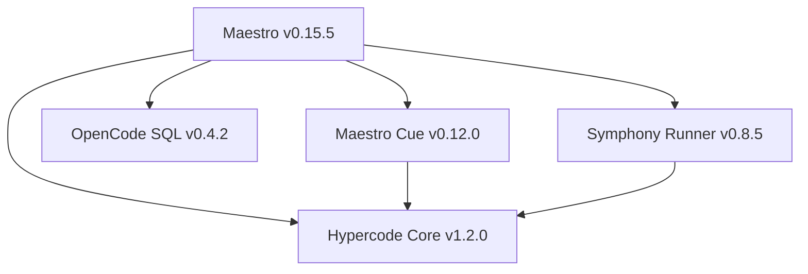

# Submodule Dashboard

This dashboard tracks the status and integration points of all Maestro submodules.

| Submodule           | Version | Location                     | Integration Point             | Build Status |
| :------------------ | :------ | :--------------------------- | :---------------------------- | :----------- |
| **Hypercode Core**       | v1.2.0  | `submodules/hypercode-core`       | `HypercodeLiveProvider.ts`         | ✓ Stable     |
| **Symphony Runner** | v0.8.5  | `submodules/symphony`        | `symphony-runner.ts`          | ✓ Integrated |
| **OpenCode SQL**    | v0.4.2  | `submodules/opencode-sqlite` | `opencode-session-storage.ts` | ✓ Migrated   |
| **Maestro Cue**     | v0.12.0 | `submodules/maestro-cue`     | `cue-engine.ts`               | ✓ Polished   |

## Dependency Graph

