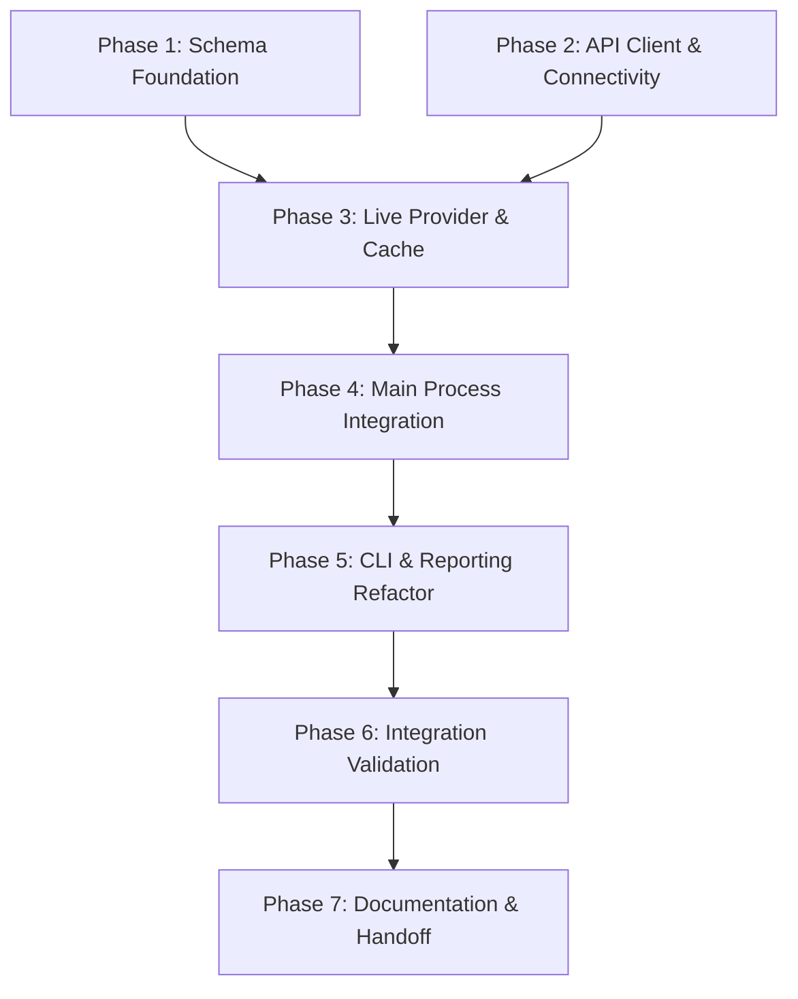

# Implementation Plan: Maestro-Hypercode Assimilation

**Date**: 2026-03-23
**Task Complexity**: Complex
**Design Document**: docs/maestro/plans/2026-03-23-maestro-hypercode-assimilation-design.md

## 1. Plan Overview

This plan outlines the systematic replacement of Maestro's native Markdown state engine with a unified Hypercode-native protocol. We will implement a new TypeScript service layer that communicates with a Live Hypercode Core control plane while maintaining a local cache for performance.

## 2. Dependency Graph

## 3. Execution Strategy

| Stage | Phases | Agent(s)                | Mode       |
| ----- | ------ | ----------------------- | ---------- |
| 1     | 1, 2   | architect, api_designer | Parallel   |
| 2     | 3      | coder                   | Sequential |
| 3     | 4      | coder, architect        | Sequential |
| 4     | 5      | coder                   | Sequential |
| 5     | 6      | tester                  | Sequential |
| 6     | 7      | technical_writer        | Sequential |

## 4. Phase Details

### Phase 1: Protocol & Schema Foundation

- **Objective**: Define the extended Hypercode-native JSON schema and the Provider interface.
- **Agent**: `architect` — Focus on architectural integrity and type safety.
- **Files to Create**:
  - `src/shared/hypercode-schema.ts`: Define `HypercodeHandoffSchema` using `zod`.
  - `src/main/services/IHypercodeProvider.ts`: Define the `IHypercodeProvider` interface.
- **Validation**: `npm run build` (ensure types compile).

### Phase 2: API Client & Connectivity

- **Objective**: Implement the low-level client for the Hypercode Core Live API.
- **Agent**: `api_designer` — Focus on robust API patterns and error handling.
- **Files to Create**:
  - `src/main/services/HypercodeCoreClient.ts`: HTTP/gRPC client for the Hypercode Core.
- **Validation**: Unit tests for connection handling and retry logic.

### Phase 3: HypercodeLiveProvider & Local Cache

- **Objective**: Implement the high-level provider and the local mirror logic.
- **Agent**: `coder` — Focus on service implementation and filesystem I/O.
- **Files to Create**:
  - `src/main/services/HypercodeLiveProvider.ts`: Implements `IHypercodeProvider`.
  - `src/main/services/LocalCacheManager.ts`: Manages `.hypercode/handoffs/` mirror.
- **Validation**: `npm test src/main/services/HypercodeLiveProvider.test.ts`.

### Phase 4: Main Process Integration

- **Objective**: The "Brain Transplant"—refactor core session logic to use Hypercode.
- **Agent**: `coder` (Lead), `architect` (Reviewer).
- **Files to Modify**:
  - `src/main/web-server/managers/LiveSessionManager.ts`: Replace native state logic with `HypercodeLiveProvider`.
  - `src/main/group-chat/group-chat-router.ts`: Update agent handoff logic to use Hypercode handoff JSON.
- **Validation**: Verify session creation and phase transitions in dev mode.

### Phase 5: CLI & Reporting Refactor

- **Objective**: Update CLI commands to source data from the new unified protocol.
- **Agent**: `coder`.
- **Files to Modify**:
  - `src/cli/commands/*.ts`: Specifically `status`, `list-agents`, `show-agent`.
  - `scripts/read-active-session.js`: Refactor to parse Hypercode JSON.
- **Validation**: `/maestro:status` outputs correct data from Hypercode Core.

### Phase 6: Integration Validation

- **Objective**: Exhaustive verification of the full lifecycle against the Live Core.
- **Agent**: `tester`.
- **Files to Create**:
  - `src/__tests__/integration/hypercode-assimilation.test.ts`: E2E integration test.
- **Validation**: Run full integration suite; verify zero-drift success criteria.

### Phase 7: Documentation & Handoff

- **Objective**: Finalize documentation and architectural cleanup.
- **Agent**: `technical_writer`.
- **Files to Modify**:
  - `ARCHITECTURE.md`: Update to reflect the Hypercode-native engine.
  - `PROTOCOL.md` (New): Document the extended Hypercode-Maestro JSON schema.
- **Validation**: Peer review of documentation.

## 5. File Inventory

| Action | Path                                                  | Purpose                               | Phase |
| ------ | ----------------------------------------------------- | ------------------------------------- | ----- |
| Create | `src/shared/hypercode-schema.ts`                           | Zod schema for extended Hypercode handoffs | 1     |
| Create | `src/main/services/IHypercodeProvider.ts`                  | Interface for Hypercode integration        | 1     |
| Create | `src/main/services/HypercodeCoreClient.ts`                 | Low-level API client for Hypercode Core    | 2     |
| Create | `src/main/services/HypercodeLiveProvider.ts`               | Primary state management service      | 3     |
| Create | `src/main/services/LocalCacheManager.ts`              | Mirror manager for .hypercode/handoffs/    | 3     |
| Modify | `src/main/web-server/managers/LiveSessionManager.ts`  | Core session refactor                 | 4     |
| Modify | `src/main/group-chat/group-chat-router.ts`            | Agent handoff refactor                | 4     |
| Modify | `src/cli/commands/*.ts`                               | CLI reporting refactor                | 5     |
| Modify | `scripts/read-active-session.js`                      | Legacy script refactor                | 5     |
| Create | `src/__tests__/integration/hypercode-assimilation.test.ts` | Full lifecycle verification           | 6     |
| Modify | `ARCHITECTURE.md`                                     | Architecture update                   | 7     |
| Create | `PROTOCOL.md`                                         | Protocol specification                | 7     |

## 6. Risk Classification

| Phase | Risk   | Rationale                                                  |
| ----- | ------ | ---------------------------------------------------------- |
| 1     | LOW    | Purely definition based.                                   |
| 2     | MEDIUM | Connectivity issues with Hypercode Core.                        |
| 3     | MEDIUM | Filesystem I/O and atomic write complexity.                |
| 4     | HIGH   | Brain transplant; high regression risk for agent handoffs. |
| 5     | MEDIUM | Breaking changes for existing CLI tools.                   |
| 6     | LOW    | Validation only.                                           |
| 7     | LOW    | Documentation only.                                        |

## 7. Execution Profile

- Total phases: 7
- Parallelizable phases: 2 (Phase 1, 2)
- Sequential-only phases: 5
- Estimated parallel wall time: 4-6 hours
- Estimated sequential wall time: 8-10 hours

## 8. Cost Summary

| Phase     | Agent            | Model | Est. Input | Est. Output | Est. Cost |
| --------- | ---------------- | ----- | ---------- | ----------- | --------- |
| 1         | architect        | Pro   | 5K         | 2K          | $0.13     |
| 2         | api_designer     | Pro   | 8K         | 4K          | $0.24     |
| 3         | coder            | Pro   | 12K        | 6K          | $0.36     |
| 4         | coder            | Pro   | 20K        | 10K         | $0.60     |
| 5         | coder            | Pro   | 15K        | 8K          | $0.47     |
| 6         | tester           | Pro   | 10K        | 5K          | $0.30     |
| 7         | technical_writer | Pro   | 5K         | 3K          | $0.17     |
| **Total** |                  |       | **85K**    | **38K**     | **$2.27** |

_Note: Native parallel execution currently runs agents in autonomous mode. All tool calls are auto-approved without user confirmation._
